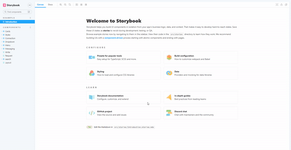
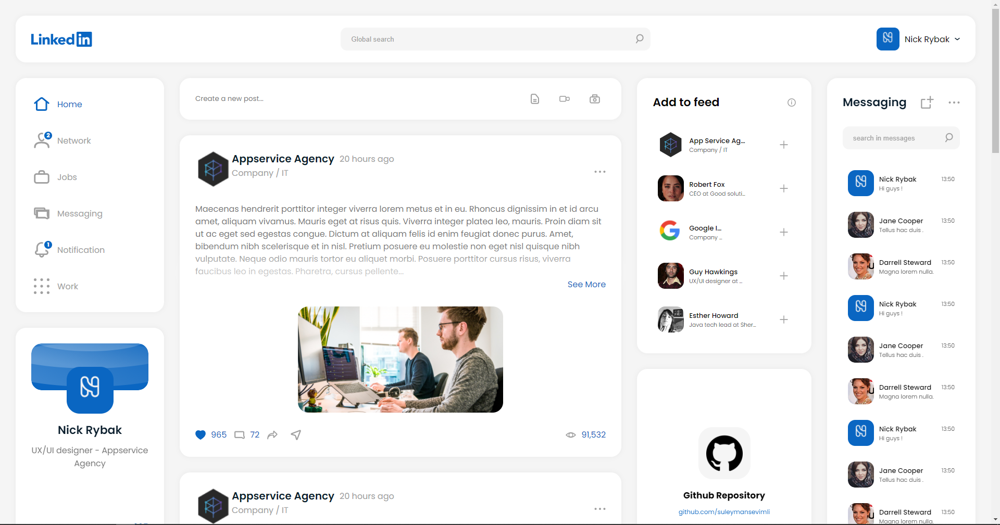

## Getting Started

First, run the development server:

```bash
npm run dev
# or
yarn dev
```

Open [http://localhost:3000](http://localhost:3000) with your browser to see the result.

You can start editing the page by modifying `pages/index.js`. The page auto-updates as you edit the file.


###Live demo : [CLICK FOR LIVE DEMO](https://localhost:3000)


### Storybook
If you want show the components how its work you can run this code ; 
```bash
npm run storybook
# or
yarn storybook
```




### Screenshot



